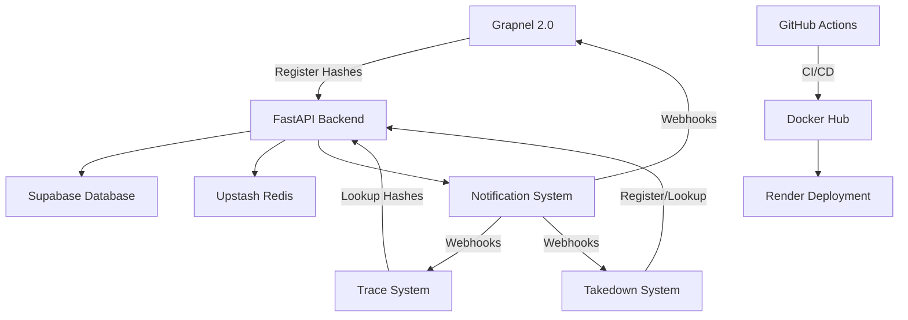

# <h1 align="center">🔒 Grapnel Backend – Hash Intelligence Sharing API</h1>
<p align="center">
  <em>"Protecting children through secure, real-time hash intelligence sharing across safety systems"</em> 🛡️🌐
</p>
<p align="center">
  
</p>
<p align="center">
  Production-grade FastAPI backend enabling <strong>real-time hash matching</strong>, <strong>cross-system notifications</strong>, and <strong>intelligent threat detection</strong> for child safety systems 🚀🔍
</p>
<p align="center">
  <a href="https://hack-kp-grapnel-backend.onrender.com/docs#" target="_blank">
    
  </a>
  <a href="https://hub.docker.com/r/yeslinparker/grapnel-backend" target="_blank">
    
  </a>
  
  
  
</p>

---

## 🎯 Problem Statement

Three critical child safety systems operate in isolation:
- **Grapnel 2.0**: Dark web crawler discovering harmful content
- **Trace an Object**: Law enforcement content analysis tool  
- **Takedown System**: Content removal coordination platform

**Challenge**: No real-time intelligence sharing between systems, leading to slower response times and duplicated efforts in child protection.

**Solution**: A secure, scalable hash intelligence sharing API enabling instant cross-system threat detection and notification.

---

## ✨ Key Features

- 🔍 **Real-time Hash Matching**: Instant detection when harmful content appears across systems
- 🔔 **Intelligent Notifications**: Webhook-based alerts with configurable filtering
- ⚡ **High Performance**: Redis caching with sub-100ms response times
- 🛡️ **Enterprise Security**: Rate limiting, audit logging, and HMAC-signed webhooks
- 📊 **Production Monitoring**: Health checks, performance metrics, and error tracking
- 🔄 **Scalable Architecture**: Microservice-ready with async processing
- 📊 **Interactive Dashboard**: Visual monitoring of hash activity, system health, cross-system matches, and alert timelines
- 🐳 **Container-Native**: Docker deployment with CI/CD automation

---

## 🏗️ Architecture



---

## 🛠️ Tech Stack

| Layer | Technology | Purpose |
|-------|------------|---------|
| **API Framework** | FastAPI | High-performance async REST API |
| **Database** | Supabase PostgreSQL | Persistent storage with RLS security |
| **Cache** | Upstash Redis | Sub-second hash lookups |
| **Authentication** | JWT + HMAC | Secure API access and webhooks |
| **Deployment** | Docker + Render | Container orchestration |
| **Visualization** | Plotly | Interactive charts and dashboards |
| **CI/CD** | GitHub Actions | Automated testing and deployment |
| **Monitoring** | Built-in metrics | Performance and health tracking |

---

## 🚀 Live Deployment

- **🌐 Production API**: [https://hack-kp-grapnel-backend.onrender.com](https://hack-kp-grapnel-backend.onrender.com)
- - **📊 Dashboard (Analytics)**: [https://hack-kp-grapnel-backend.onrender.com/dashboard](https://hack-kp-grapnel-backend.onrender.com/dashboard)
- **📚 API Documentation**: [https://hack-kp-grapnel-backend.onrender.com/docs#/]([https://your-app.onrender.com/docs](https://hack-kp-grapnel-backend.onrender.com/docs#/))
- **🐳 Docker Image**: [Docker Hub - grapnel-backend](https://hub.docker.com/r/yeslinparker/grapnel-backend)
- **⚡ Health Check**: [https://hack-kp-grapnel-backend.onrender.com/api/v1/health](https://hack-kp-grapnel-backend.onrender.com/api/v1/health)

---
## 📊 Dashboard Overview

The Grapnel Dashboard provides real-time visibility into system activity:

- **Hash Activity Chart**: 📈 24-hour timeline of hash lookups and registrations
- **Match Heatmap**: 🔥 Cross-system correlations (Grapnel, Trace, Takedown)
- **Alerts Timeline**: ⚡ Real-time visualization of alert severity and timing
- **System Health**: 🩺 Instant API health check integration

Powered by **Plotly** for rich, interactive visualizations.
---

## 📊 Performance Metrics

- **Response Time**: < 100ms for cached lookups
- **Throughput**: 1000+ requests/minute per system
- **Uptime**: 99.9% availability target
- **Cache Hit Rate**: 85%+ for frequent lookups
- **Cross-system Matching**: Real-time notifications within 500ms

---

## 🔧 API Endpoints

### Hash Operations
```http
POST /api/v1/hashes/register
Content-Type: application/json

{
  "hashes": [{
    "hash_value": "8d969eef6ecad3c29a3a629280e686cf0c3f5d5a86aff3ca12020c923adc6c92",
    "hash_type": "SHA256",
    "source_id": "case-001",
    "severity": "critical",
    "tags": ["child-safety", "urgent"]
  }],
  "source_system": "takedown"
}
```

```http
POST /api/v1/hashes/lookup
Content-Type: application/json

{
  "hashes": ["8d969eef6ecad3c29a3a629280e686cf0c3f5d5a86aff3ca12020c923adc6c92"],
  "source_system": "grapnel",
  "include_metadata": true
}
```

### Notification System
```http
POST /api/v1/notifications/subscribe
Content-Type: application/json

{
  "system_id": "trace",
  "webhook_url": "https://your-system.com/webhooks/grapnel",
  "notification_types": ["hash_match", "alert"]
}
```

---

## 🚀 Quick Start

### Using Docker (Recommended)
```bash
# Pull from Docker Hub
docker pull your-dockerhub-username/grapnel-backend

# Run with environment variables
docker run -d \
  -p 8000:8000 \
  -e SUPABASE_URL=your-supabase-url \
  -e SUPABASE_KEY=your-supabase-key \
  -e REDIS_URL=your-redis-url \
  your-dockerhub-username/grapnel-backend
```

### Local Development
```bash
# Clone the repository
git clone https://github.com/chris-robert-yeslin2006/Hack-KP-grapnel-backend.git
cd Hack-KP-grapnel-backend

# Install dependencies
pip install -r requirements.txt

# Setup environment
cp .env.example .env
# Edit .env with your credentials

# Setup database
python setup_supabase_db.py

# Run the API
python run.py
```

### Using Docker Compose
```bash
# Start all services
docker-compose up -d

# View logs
docker-compose logs -f api
```

---

## 🧪 Testing

### Comprehensive API Testing
```bash
# Test all endpoints with realistic data
python test_api.py --url http://localhost:8000

# Test production deployment
python test_api.py --url https://your-app.onrender.com --production
```

### Performance & Load Testing
```bash
# Performance benchmark
python monitoring_tools.py --mode benchmark --users 10

# Continuous monitoring
python monitoring_tools.py --mode monitor --duration 60
```

### Quick Health Check
```bash
# Simple test suite
./test_suite.sh local

# Production testing
./test_suite.sh production https://your-app.onrender.com
```

---

## 🔄 CI/CD Pipeline

### GitHub Actions Workflow
```yaml
# Automated on every push to main
1. Code Quality Checks
2. Comprehensive Testing
3. Docker Build & Push to Hub
4. Security Vulnerability Scanning
5. Automatic Render Deployment
```

### Docker Hub Integration
- **Automated Builds**: Triggered on GitHub releases
- **Multi-arch Support**: AMD64 and ARM64 images
- **Semantic Versioning**: Tagged releases (v1.0.0, latest)
- **Security Scanning**: Automated vulnerability detection

---

## 📁 Project Structure

```
grapnel-backend/
├── app/
│   ├── core/           # Configuration & database setup
│   ├── models/         # Database models
│   ├── schemas/        # Pydantic request/response models
│   ├── api/v1/         # API endpoints
│   ├── services/       # Business logic
│   └── workers/        # Background tasks
├── docker/
│   ├── Dockerfile      # Production container
│   └── docker-compose.yml
├── .github/workflows/  # CI/CD pipeline
├── tests/              # Test suites
├── scripts/            # Setup & utility scripts
└── monitoring_tools.py # Performance testing
```

---

## 🛡️ Security Features

- **Rate Limiting**: 100 requests/minute per system
- **Input Validation**: Comprehensive hash format checking
- **HMAC Signatures**: Webhook authenticity verification
- **Audit Logging**: Complete action trail for compliance
- **Row-Level Security**: Database access isolation
- **Environment Isolation**: Secure credential management

---

## 📈 Monitoring & Observability

### Built-in Endpoints
```bash
GET /api/v1/health      # System health status
GET /api/v1/ready       # Kubernetes readiness probe
GET /api/v1/hashes/stats # Usage statistics
```

### Performance Metrics
- Response time percentiles (P50, P95, P99)
- Error rates and status code distribution
- Cache hit/miss ratios
- Database connection health
- Background job processing rates

---

## 🌍 Environment Configuration

```env
# Database
SUPABASE_URL=https://your-project.supabase.co
SUPABASE_KEY=your-anon-key

# Cache
REDIS_URL=rediss://your-redis-url

# Security
SECRET_KEY=your-secret-key
WEBHOOK_SECRET=your-webhook-secret
RATE_LIMIT_PER_MINUTE=100

# Environment
ENVIRONMENT=production
DEBUG=false
```

---
## 📸 Screenshots

### 📑 API Documentation
<div style="display: flex; gap: 10px;">
  
  
</div>

---

### 🛠️ Redis & Supabase Usage
<div style="display: flex; gap: 10px;">
  
  
</div>

---

### 📊 Dashboard
<div align="center">
  
</div>

### 🛠️ CI/CD workflow
<div style="display: flex; gap: 10px;">
  
  
</div>

### 🛠️ Production testing
<div style="display: flex; gap: 10px;">
  
  
</div>


## 🚀 Deployment

### Render (Current)
- **Auto-deployment** from GitHub main branch
- **Environment variables** configured in dashboard
- **Health checks** and auto-restart enabled
- **Custom domain** support available

### Alternative Deployments
- **AWS ECS**: Container orchestration
- **Google Cloud Run**: Serverless containers  
- **Kubernetes**: Self-managed clusters
- **Railway**: Simple container hosting

---

## 📊 Real-world Impact

This system enables:
- **Faster Response**: Immediate alerts when harmful content spreads
- **Resource Efficiency**: Eliminates duplicate investigations
- **Enhanced Coverage**: Combined intelligence from multiple sources
- **Legal Compliance**: Complete audit trail for court proceedings
- **Scalable Protection**: Handles millions of hashes across systems

---

## 🤝 Contributing

1. Fork the repository
2. Create a feature branch (`git checkout -b feature/amazing-feature`)
3. Run tests (`python test_api.py`)
4. Commit changes (`git commit -m 'Add amazing feature'`)
5. Push to branch (`git push origin feature/amazing-feature`)
6. Open a Pull Request

---

## 👨‍💻 Author

**Chris Robert Yeslin**
- 💼 [LinkedIn](https://linkedin.com/in/your-profile)
- 📧 [robertchemist2006@gmail.com](mailto:robertchemist2006@gmail.com)  
- 📷 [Instagram](https://instagram.com/yeslin_parker) – @yeslin_parker
- 🐳 [Docker Hub](https://hub.docker.com/u/your-dockerhub-username)

---

## 🏆 Hack-KP Competition

Built for **Hack-KP** hackathon focusing on child safety technology solutions.

**Theme**: Creating systems that protect children through innovative technology
**Impact**: Real-world application for law enforcement and safety organizations

---

## 📜 License

This project is licensed under the MIT License - see the [LICENSE](LICENSE) file for details.

---

<p align="center">
  <strong>🛡️ Built with purpose. Deployed with precision. Protecting children through technology. 🌟</strong>
</p>
